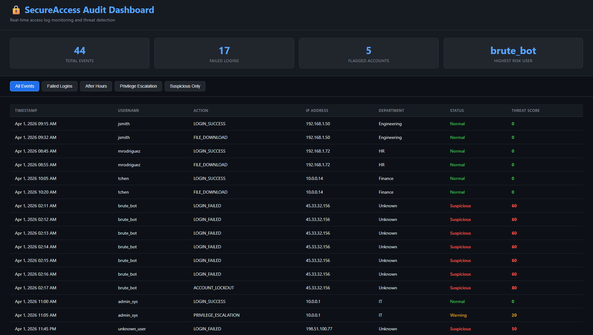

# 🔒 SecureAccess Audit Dashboard


A browser-based security audit dashboard that analyzes user access logs, detects suspicious authentication patterns, and calculates threat scores — built with vanilla HTML, CSS, and JavaScript. No frameworks. No dependencies. No backend.

> Simulates the core monitoring workflow of enterprise SIEM tools like Splunk and AWS CloudWatch.

---

## 📸 Dashboard Preview



---

## ⚙️ What It Does

- Loads and parses 44 structured security log entries from a local JSON dataset
- Calculates a **threat score** for every event using multi-signal correlation
- Color-codes events as **Normal**, **Warning**, or **Suspicious**
- Filters logs by category: Failed Logins, After Hours, Privilege Escalation, Suspicious
- Displays live summary stats: total events, failed logins, flagged accounts, highest risk user

---

## 🧮 Threat Scoring Engine

Each log entry starts at 0. The scoring engine applies these rules:

| Condition | Points |
|---|---|
| LOGIN_FAILED action | +10 |
| Event between 10 PM – 6 AM | +15 |
| PRIVILEGE_ESCALATION action | +20 |
| ACCOUNT_LOCKOUT action | +30 |
| Username has 3+ failed logins in dataset | +25 (applied to all entries for that user) |
| IP address tied to multiple usernames | +10 |

**Score thresholds:**
- `0–19` → 🟢 Normal
- `20–49` → 🟡 Warning  
- `50+` → 🔴 Suspicious

---

## 🔍 Security Patterns Detected

**Brute Force Attack**
`brute_bot` generates 8 failed logins from external IP `45.33.32.156` between 2–4 AM. The engine correlates failed login volume, after-hours timing, and external IP origin → score of 60–80.

**Possible Account Compromise**
`admin_sys` performs a PRIVILEGE_ESCALATION from the same external IP as `brute_bot`. Shared IP across a known attacker and an admin account is a critical indicator of compromise.

**Credential Theft Pattern**
`dwalker` downloads files from an external IP at 10 PM, followed immediately by three failed login attempts from that same IP — consistent with stolen credentials being tested after an exfiltration attempt.

**Baseline Normal Activity**
Business-hours logins from internal IPs (`192.168.x.x`, `10.0.x.x`) score 0. The system surfaces anomalies without generating noise on legitimate activity.

---

## 🛠️ Tech Stack

| Layer | Technology |
|---|---|
| Structure | HTML5 |
| Styling | CSS3 (dark theme, Flexbox layout) |
| Logic | Vanilla JavaScript (ES6+) |
| Data | JSON (44 log entries, no backend) |
| Dev Server | VS Code Live Server |

---

## 🚀 How to Run
```bash
git clone https://github.com/cruisethecity/SecureAccess-Audit-Dashboard.git
cd SecureAccess-Audit-Dashboard
# Open with VS Code Live Server or any static file server
```

No build step. No dependencies. No API keys.

---

## 💼 Relevance to IT and Security Roles

This project demonstrates working knowledge of:

- **IAM concepts** — authentication events, privilege escalation, account lockout behavior
- **Threat detection** — multi-signal scoring, brute force pattern recognition
- **Log analysis** — filtering, correlation, timeline reconstruction
- **SIEM fundamentals** — replicates the core triage workflow of tools like Splunk and IBM QRadar
- **Security-first design** — least-privilege thinking, alert fatigue reduction through scored thresholds

---

*Part of a cloud engineering and cybersecurity portfolio by Keenen Wilkins. See also: [AI Ticket Triage Agent](https://github.com/cruisethecity/AI-Ticket-Triage-Agent) | [AWS Infrastructure Projects](https://github.com/cruisethecity)*
